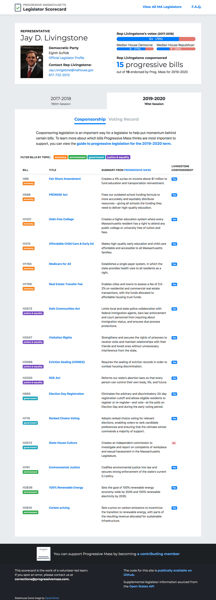

# Progressive Massachusetts Legislator Scorecard

Taking somewhat dry legislator information from various spreadsheets administered by [Progressive Massachusetts](https://www.progressivemass.com/) and turning it into a ...slightly less dry interactive app.

[**Check out the scorecard app here**](http://scorecard.progressivemass.com)

## Technical details

The gatsbyjs statically-generated site [uses Google Sheets as a lightweight CMS](https://docs.google.com/spreadsheets/d/17SfLTsqLaoBG8WE5vKHmBY_J6Iz1IFKThm_wAqsHZdg) and also sources additional legislator data from the [Open States API](https://docs.openstates.org/en/latest/api/v2/).

Hosted on Google Firebase, with a Firebase serverless function for fetching geolocation data, and automated deployments using Github actions.

Site created by [@aholachek](https://github.com/aholachek) and currently administered by [@dscush](https://github.com/dscush).

## Contributing

You can build the site locally by simply running `yarn start` after cloning the repo. To build the data, you'll need to copy `.env.template` to `.env` and then add your own Google API key (it must be Google Sheets enabled) and an Open States API key. You should then be able to run the `yarn build-data` command to fetch legislator data.
